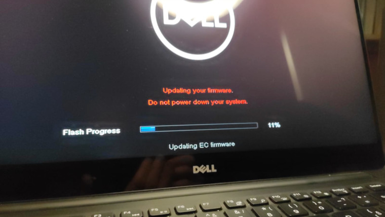
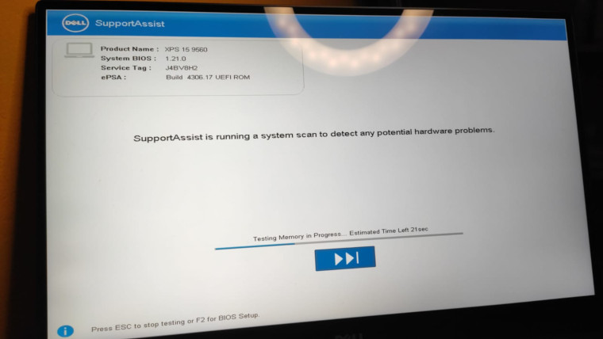
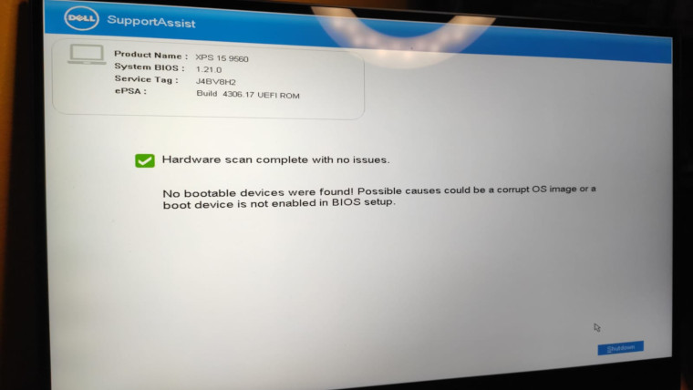

title: Upgrading Fedora 31 -> 33 on a Dell
date: 2020-12-26 16:30
modified: 2020-12-26 16:30
tags: fedora, linux, upgrading, firmware, clusterfuck
keywords: upgrading, fedora, version 31, version 33, dell, xps 9560
category: HowTo
slug: upgrading-fedora-31-to-33-on-a-dell
author: Roman Luštrik
summary: Sometimes, upgrading Fedora on a Dell laptop may not be the experience you are after in a computer.
lang: en
status: published

Upgrading operating system usually isn't a pleasant experience in my book. This is especially true for Linux machines. This experience is drawn based on playing around in Debian, Ubuntu and lately, Fedora.

Against my better judgment I decided to upgrade to the latest Fedora version (currently 33). Basically, I followed instructions such as [these](https://www.linuxjournal.com/content/how-upgrade-fedora-32-fedora-33-cli-graphical-methods), where you install a plugin, upgrade package and finally the OS.

```bash
# This is a one-time operation.
$ sudo dnf install dnf-plugin-system-upgrade

$ sudo dnf upgrade --refresh
$ sudo dnf system-upgrade download --releasever=32
$ sudo dnf system-upgrade reboot
```

When installing 31 -> 32, I did `dnf update --refresh`, under Software installed everything that had to be upgraded and went through with the upgrade. Upon reboot (last command), computer's firmware started to be upgraded. It would seem there were some firmware updates. It didn't take long for the error messages to start popping up and computer automatically shutting down. Great.

</img>

After turning it on, I kept getting an assistant window which tried to correct mistakes. It would seem that unable to find a bootable device means nothing is wrong.

</img>
</img>

At this point no amount of reboots helped. Having all the backups I was not worried but I did manage to forget to create a bootable Fedora LiveUSB drive. Great again.

Calling a friend, he created the latest Fedora workstation 33 image. When we tried to boot from that USB drive, the problem was that the computer wouldn't even turn on. After searching the internet for possible answers and doing all sorts of combinations with holding down the power button and connecting/disconnecting the computer from power source, all of a sudden the computer woke up and resumed upgrading Fedora (without the USB key). What. The. Fuck.

After the upgrade finished, I followed the same three steps (upgrade, system-upgrade and reboot) for version 33 and that time around, things went smoothly.
