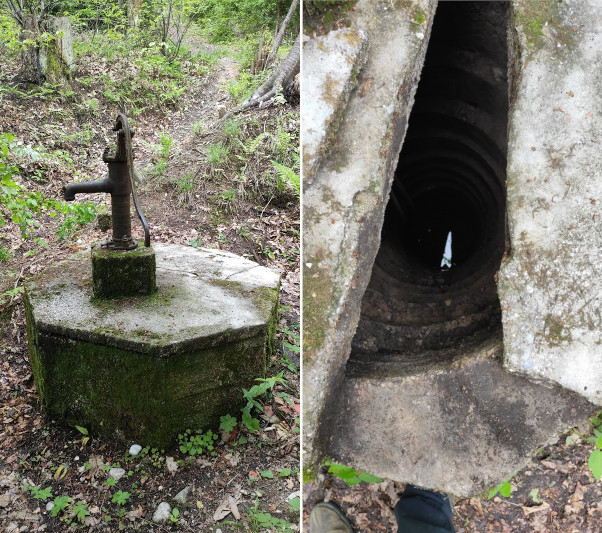
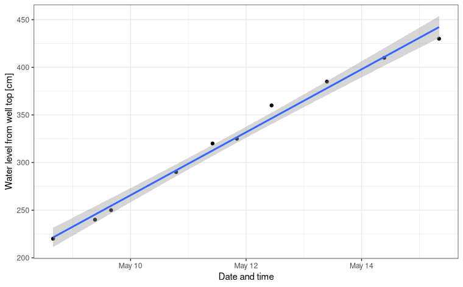

title: Water well outflow rate
date: 2021-05-15 08:50
modified: 2021-05-15 08:50
tags: well, drying, water level, rainfall, linear model, statistics, R
keywords: water, well drying rate, rainfall, statistics, outflow rate
category: HowTo
slug: water-well-drying-rate
author: Roman Luštrik
summary: To know the rate of drying of my waterwell, I made some measurements for about a week. Here are the results
lang: en
translation: false
status: published

The house I live in has been built around 1939 and is accompanied by a water well that is about 6 m deep. This was dug out by hand, 0.5 m a day, added scaffolding, added concrete and so on for a few weeks. I think, but see the below figure where on the right side you can see the jagged ledges that would explain this hypothesis.

In the past (think 1990), this well has been the only source of water for the house, but ever since we've been connected to a public water source, it's been there mostly for show.

<center>

</center>

Soon we'll be rebuilding the house and rainfall from the roof will have to go somewhere. One of the options is to use this well to siphon the water into. It would be a great feature if the water would flow out of the well so as not to overflow.

In the first week of this May, there was a large rainfall and water level was about 220 cm above the top edge of the well (about 1 m under the surface). This was the ideal opportunity for me to measure how fast the water will go down. Using a tape measure, I measured the distance from the top of the well to the water level with about 5 cm accuracy. It's hard to measure precisely because I could only approximately see when the measurer hit the water level. I noted date and time and wrote it down into a Google Spreadsheet table.

To calculate the rate, I created a (generalized) linear model where I would model water level height as a function of time (seconds). In R parlance, that would be `glm(water_level_height ~ time)`. Summary of the model is

```r
##
## Call:
## glm(formula = razdalja_cm ~ date_time, data = xy)
##
## Deviance Residuals:
##     Min       1Q   Median       3Q      Max  
## -12.257   -3.863   -1.472    4.954   13.578  
##
## Coefficients:
##                     Estimate       Std. Error t value      Pr(>|t|)    
## (Intercept) -619585.78740010   22316.13758332  -27.76 0.00000000306 ***
## date_time         0.00038248       0.00001377   27.78 0.00000000304 ***
## ---
## Signif. codes:  0 '***' 0.001 '**' 0.01 '*' 0.05 '.' 0.1 ' ' 1
##
## (Dispersion parameter for gaussian family taken to be 61.77171)
##
##     Null deviance: 48160.00  on 9  degrees of freedom
## Residual deviance:   494.17  on 8  degrees of freedom
## AIC: 73.382
##
## Number of Fisher Scoring iterations: 2
```

If you look at the `date_time` coefficient, it says that the water level changes 0.00038 cm per second. That makes it about 33 cm a day. The measurements were taken in the span of 6.68 days, so the total lowering of the water level was about 221 cm (calculated backwards from the model). Which is approximately what I measured, starting at 220 cm and ending at 430 cm below water well edge.

To put this into liters, given the diameter of 100 cm, that translates to outflow of 230 L of water per day.


